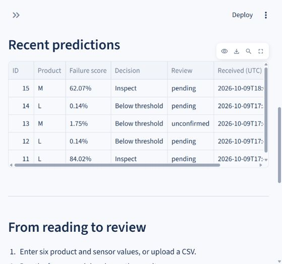
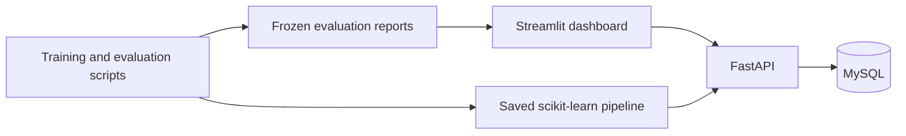

# Machine Failure Inspection

A Python machine-learning application that scores machine sensor snapshots, suggests inspections, and saves predictions and reviews in MySQL. Built with scikit-learn, FastAPI, Streamlit, SQLAlchemy, and Alembic.

## Features

- Single predictions from six product and sensor inputs, with failure scores displayed as percentages.
- CSV batch validation, atomic prediction saves, and downloadable results.
- Prediction history with product, decision, and UTC date filters.
- Inspection review statuses and notes stored separately from benchmark labels.
- Frozen model evaluation, classification reports, precision–recall curves, and a confusion matrix.
- Dataset checks, reproducible training scripts, model metadata, and automated tests.



## Architecture



## Model results

The selected random forest uses six sensor/product inputs and engineered physical features. Training, validation, and test partitions contain 6,000, 2,000, and 2,000 records in original dataset order. The decision threshold was selected on validation and frozen before final testing.

| Final-test metric | Result |
|---|---:|
| Average precision | 0.7923 |
| Failure precision | 82.35% |
| Failure recall | 71.79% |
| Failure F1 | 0.7671 |
| ROC-AUC | 0.9658 |
| Detected failures / labelled failures | 28 / 39 |
| False alerts / missed failures | 6 / 11 |
| Alert threshold | 30.59% |

The [UCI AI4I 2020 dataset](https://archive.ics.uci.edu/dataset/601/ai4i%2B2020%2Bpredictive%2Bmaintenance%2Bdataset) is synthetic and distributed under CC BY 4.0. This project classifies the current sensor snapshot. Scores are not calibrated failure probabilities, and the benchmark does not establish real-machine performance or a future failure date. Target, identifiers, and failure-mode outcome flags are excluded from the input features.

## Run locally

Requirements: Python 3.12 and a local MySQL server. The commands below use Windows PowerShell.

```powershell
git clone https://github.com/deepanshunig/Machine-failure-inspection.git
cd Machine-failure-inspection/machine-failure-dashboard
python -m venv .venv
.\.venv\Scripts\python.exe -m pip install -r requirements-lock.txt
.\.venv\Scripts\python.exe -m pip install --no-deps -e .
Copy-Item .env.example .env
```

Create a dedicated database account using the [MySQL setup template](machine-failure-dashboard/sql/setup_mysql.example.sql), then edit your local `.env` with its connection details. Set `API_URL=http://127.0.0.1:8001`. Real credentials belong only in `.env`, which Git ignores.

Initialize the schema and start the API:

```powershell
.\.venv\Scripts\python.exe -m machine_failure.db initialize
.\.venv\Scripts\python.exe -m uvicorn machine_failure.api:app --host 127.0.0.1 --port 8001
```

From the same project folder in a second terminal, start the dashboard:

```powershell
.\.venv\Scripts\python.exe -m streamlit run app/dashboard.py --server.address 127.0.0.1 --server.port 8502
```

Open [the dashboard](http://127.0.0.1:8502) or [the API documentation](http://127.0.0.1:8001/docs). The evaluated model and dataset are included, so retraining is optional.

## Verification and documentation

Run from `machine-failure-dashboard/`:

```powershell
.\.venv\Scripts\python.exe -m pytest
.\.venv\Scripts\python.exe -m ruff check .
```

The suite covers data and evaluation contracts, model boundaries, API behavior, and dashboard workflows. Saved live MySQL and browser checks are included in `reports/`.

- [Detailed setup, training, evaluation, and API guide](machine-failure-dashboard/README.md)
- [Frozen evaluation report](machine-failure-dashboard/reports/final_evaluation.json)
- [Model report](machine-failure-dashboard/reports/model_report.md)
- [Build plan](machine-failure-project-plan.md)

Implementation milestones 1–5 are complete. Docker packaging, CI, and cloud deployment remain future work.
