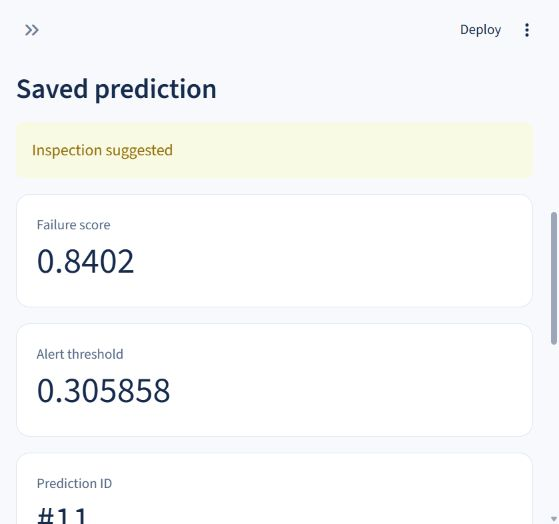

# Machine Failure Classification and Inspection Dashboard

A portfolio project that classifies a sensor snapshot, records predictions in MySQL, and explains its evaluation. Implementation follows verified milestones.

## Current progress

Steps 1–5 are complete and verified. The selected random forest has final-test average precision **0.7923**, failure recall **71.79%**, and precision **82.35%**. It detected 28 of 39 failures, missed 11, and raised 6 false alerts on 2,000 test snapshots. These measurements describe this synthetic dataset.

Step 4 passed against local **MySQL 9.7.0**, with schema revision `0001`. A dedicated project account is configured in the ignored `.env` file. Real-database checks verify prediction persistence, history, reviews, score constraints, foreign keys, rollback, and matching offline/API scores. The schema matches Alembic models, and all five documented SQL queries work. See `reports/step4_report.md`, `reports/mysql_smoke.json`, and `reports/api_http_smoke.json`.

Step 5 is complete: the Streamlit frontend is running at [localhost:8502](http://127.0.0.1:8502). Single predictions, CSV upload/export, filters, review updates, evaluation metrics, and training-data exploration are implemented. Browser checks confirmed actual MySQL saves and invalid-upload rejection. **34 automated tests and Ruff pass.** Evidence is in `reports/step5_report.md`, `reports/frontend_smoke.json`, and `reports/screenshots/`. Step 6 packaging and CI has not started.

## Python setup (Windows PowerShell)

Use Python 3.12. Activation is optional; the commands explicitly address the virtual environment.

```powershell
python -m venv .venv
.\.venv\Scripts\python.exe -m pip install -e ".[dev]"
.\.venv\Scripts\python.exe -m machine_failure.data prepare --root .
.\.venv\Scripts\python.exe -m pytest
.\.venv\Scripts\python.exe -m ruff check .
```

After installation, `requirements-lock.txt` records the tested dependency versions. On a new machine, install those versions first, then the package without dependency resolution:

```powershell
.\.venv\Scripts\python.exe -m pip install -r requirements-lock.txt
.\.venv\Scripts\python.exe -m pip install --no-deps -e .
```

For this workspace, the available base interpreter is:

```powershell
& "$env:USERPROFILE\.cache\codex-runtimes\codex-primary-runtime\dependencies\python\python.exe" -m venv .venv
```

If the restricted environment prevents Python writing temporary installation files, set `TMPDIR`, `TEMP`, and `TMP` to a writable `.cache/tmp` directory for that setup session.

## Data and attribution

Source: [UCI AI4I 2020 Predictive Maintenance Dataset](https://archive.ics.uci.edu/dataset/601/ai4i%2B2020%2Bpredictive%2Bmaintenance%2Bdataset), DOI [10.24432/C5HS5C](https://doi.org/10.24432/C5HS5C), released under CC BY 4.0. The downloader preserves the official CSV bytes and verifies their SHA-256 checksum. This is synthetic data; the target labels failure in the current datapoint. Future failure dates and real industrial outcomes require different validation.

Inputs are product type, air temperature (K), process temperature (K), rotational speed (rpm), torque (Nm), and tool wear (min). The target is `Machine failure`. Identifiers and all failure-mode outcome columns are excluded from model features.

The fixed split uses original row order: 6,000 training records, 2,000 validation records, and 2,000 test records. Random-walk temperatures motivate this conservative ordered holdout. Row order is not a verified real timestamp. All exploratory feature plots use training records only. Validation/test integrity checks and aggregate label counts are recorded without fitting models on those partitions.

## Step 1 outputs

- `data/raw/ai4i2020.csv`: unchanged official CSV.
- `data/raw/provenance.json`: source, licence, checksum, and environment versions.
- `data/splits/manifest.csv`: original row indices, UDI identifiers, and partition membership.
- `reports/data_quality.json`: schema, label counts, duplicate checks, and outcome-flag discrepancies.
- `reports/data_note.md`: readable findings and limitations.
- `reports/figures/01_training_class_balance.png`.
- `reports/figures/02_training_input_distributions.png`.
- `reports/figures/03_training_correlations.png`.
- `notebooks/01_exploration.ipynb`: a guided notebook; the CLI reproduces outputs independently.

Run `python -m machine_failure.data verify --root .` to check dataset integrity and split membership without regenerating outputs.

## Step 2: offline baseline

```powershell
.\.venv\Scripts\python.exe -m machine_failure.train baseline --root .
```

This compares a dummy prior and six logistic-regression configurations in training-only forward folds, saves the selected pipeline, and writes `reports/baseline_report.md`, `reports/baseline_cv.json`, OOF predictions/errors, and two plots. Validation and test predictions are reserved for the model-evaluation stage.

## Step 3: selected model and frozen evaluation

Training selected `forest_physical_depth8_None` using training-only forward folds. The pipeline includes temperature difference, rotational power, and wear × torque. Validation selected threshold **0.3058576321894592** by F2; the API uses the same `score >= threshold` rule.

Read `reports/model_report.md`, `reports/error_review.md`, and `reports/final_evaluation.json`. Evaluation includes average precision, ROC-AUC, accuracy, failure precision/recall/F1/F2, false-alert rate, confusion counts, and a full classification report with both classes and macro/weighted averages. JSON reports include these metrics for validation, final test, threshold 0.5, and the dummy baseline. The readable model report shows the final-test results. The same test summary is included in model metadata and available through `/model-info`.

The pipeline and metadata are in `artifacts/`. The pipeline is small enough to keep with the project, so a clean checkout can use the exact evaluated model. Load only trusted local model files.

Reproduce the frozen evaluation without selecting a new model or threshold:

```powershell
.\.venv\Scripts\python.exe -m machine_failure.evaluate --root . --reproduce
```

For a fresh research run in a separate project copy without frozen evaluation outputs, the sequence is `train baseline`, `train compare`, then `evaluate`. The comparison command prevents retuning after the final test report exists.

## Step 4: MySQL and API

Keep connection details in local `.env`; it is ignored by Git. This workspace is already configured with a dedicated account restricted to `machine_failure_dashboard`. The runtime uses that account. On a new setup, configure `DB_HOST`, `DB_PORT`, `DB_NAME`, `DB_USER`, and `DB_PASSWORD` using your own dedicated account.

If that account does not exist, open MySQL Workbench with your administrator connection and use `sql/setup_mysql.example.sql` as a template. Replace its password placeholder locally before running it, then put the same password in `.env`. The template creates only the project database/account and grants privileges for that database. If the account already exists, use its existing credentials. The runtime uses SQLAlchemy and PyMySQL.

Then run, from this project directory:

```powershell
.\.venv\Scripts\python.exe -m machine_failure.db initialize
.\.venv\Scripts\python.exe -m machine_failure.db check
.\.venv\Scripts\python.exe -m machine_failure.mysql_smoke
```

The smoke check uses real MySQL, compares offline/API scores, saves two synthetic demo predictions, adds pending reviews, reads filtered/joined history, and checks score constraints, foreign keys, and batch rollback. A pass writes `reports/mysql_smoke.json`. The Step 4 acceptance gate has passed. Each run retains its demo predictions; retries can leave additional synthetic snapshots in history. Reviews and logs are separate from the official benchmark labels.

Start the API:

```powershell
.\.venv\Scripts\python.exe -m uvicorn machine_failure.api:app --host 127.0.0.1 --port 8001
```

Open [interactive API documentation](http://127.0.0.1:8001/docs). This workspace uses port 8001 because port 8000 is occupied, and local `API_URL` matches that address. `GET /health` checks both the model and database. A prediction receives a successful response only after its transaction commits. Optionally set `DEMO_API_KEY` in `.env`; then send it as `X-API-Key` for prediction, history, review, and model-information requests.

Example JSON for `POST /predict`:

```json
{
  "product_type": "L",
  "air_temperature_k": 300,
  "process_temperature_k": 310,
  "rotational_speed_rpm": 1500,
  "torque_nm": 40,
  "tool_wear_min": 100
}
```

The API rejects target/outcome fields, missing fields, invalid product types, negative wear/torque, nonpositive temperatures/speed, and non-finite values. Out-of-range readings receive training-domain warnings. Batch requests accept 1–1,000 readings and validate the entire request before persistence. History supports `limit`, `offset`, `alert`, `product_type`, `start`, and `end`. Timestamps use UTC; naive history date filters are interpreted as UTC.

`sql/inspection_queries.sql` contains SQL for joined history, alert/review counts, mean inference latency, and receipt-date filters. Benchmark scores and application log counts have different meanings.

## Step 5: Streamlit frontend

From this project directory, keep the API running on port 8001 and start the frontend in a second terminal:

```powershell
.\.venv\Scripts\python.exe -m streamlit run app/dashboard.py --server.address 127.0.0.1 --server.port 8502
```

Open [Inspection Lab](http://127.0.0.1:8502). This workspace uses port 8502 because 8501 is occupied. The narrow browser view collapses the sidebar; use the arrow at the top left to open navigation.

| Screen | Use |
|---|---|
| Overview | Actual logged snapshot/alert counts, recent predictions, frozen benchmark summary |
| Single prediction | Six fields with units, saved score/threshold/version, decision and range warnings |
| Batch upload | Download a template, validate a UTF-8 CSV, save a complete batch, download results |
| History & reviews | Filter by decision/product/UTC receipt dates; paginate; update a review and note |
| Model evaluation | AP, precision, recall, F1, F2, ROC-AUC, accuracy, false-alert rate, classification report and charts |
| Data explorer | Dataset checks, split counts, training-only plots and six-feature preview |

CSV columns must exactly match `data/examples/sensor_template.csv`. `data/examples/invalid_sensor_example.csv` demonstrates a rejected non-finite value. Duplicate/missing/extra headers, malformed rows, invalid numbers, files over 1,000,000 bytes, and batches over 1,000 rows are rejected before an API save. The dashboard and API share Pydantic input contracts. Errors identify the CSV row and field; correct the whole file before resubmitting.

All operational reads and writes call the API. The frontend does not connect directly to MySQL. Saving is disabled when the model/database connection is unavailable; saved benchmark pages still work. Inspection feedback stays separate from test labels. CSV downloads contain prediction IDs, inputs, scores, thresholds, decisions, versions, timestamps, and warnings.

The dashboard displays failure scores and alert thresholds as percentages with two decimal places. These model scores are not calibrated probabilities. API responses, MySQL records, and CSV exports retain the original 0–1 values.



## Verification

```powershell
.\.venv\Scripts\python.exe -m pytest
.\.venv\Scripts\python.exe -m ruff check .
.\.venv\Scripts\python.exe -m pip check
```

Streamlit interaction tests use its [official AppTest framework](https://docs.streamlit.io/develop/api-reference/app-testing/st.testing.v1.apptest). They isolate the HTTP client and cover submission/review flows, CSV upload/download controls, invalid-batch prevention, and offline behaviour. Live browser and database evidence is recorded separately. Streamlit 1.65.0 is locked and required for the tested file-upload interactions.

In this Codex Windows sandbox, API tests need approved local socket access because Windows asyncio creates an internal loopback connection. The same test command runs normally outside the sandbox. The installed Starlette version emits a deprecation warning for its HTTPX test-client transport; all checks pass with the locked versions.
