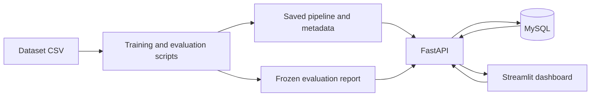

**Machine Failure Classification and Inspection Dashboard**

Build plan for a beginner-to-intermediate developer applying for the HCLTech AI Engineer role. Prepared 9 October 2026.

Implementation status: Steps 1–5 are complete in `machine-failure-dashboard/`, with saved data checks, baselines, a frozen model, final evaluation, verified MySQL/API integration, and the Streamlit frontend. MySQL 9.7.0 is configured with a dedicated project account; migration revision `0001`, constraints, rollback, SQL examples, and live HTTP workflows passed. The API uses port 8001 and the frontend uses port 8502. Browser prediction, CSV, download, validation, review, filters and metrics checks passed; 34 automated tests pass. Step 6 packaging and CI has not started. See the README and `reports/build_progress.json` for evidence.

**1. What we are building**

A user enters six sensor/product inputs or uploads a small CSV. The application validates the inputs, runs a saved machine-learning pipeline, displays a failure score and an inspection suggestion, and records the prediction in MySQL. A dashboard shows prediction history and the frozen model evaluation. A reviewer can attach an inspection note to a prediction.

The learning outcome is an application whose data preparation, model decisions, SQL queries, errors, and limitations you can explain yourself.

Use [UCI AI4I 2020](https://archive.ics.uci.edu/dataset/601/ai4i%2B2020%2Bpredictive%2Bmaintenance%2Bdataset), a synthetic dataset with 10,000 records. Its target describes failure at the current datapoint. Present the project as a sensor-snapshot classification prototype. Future failure dates and remaining useful life would require suitable longitudinal data and different evaluation.

**2. First-version scope**

| Capability | First-version behaviour |
|---|---|
| Single prediction | Form with units, valid product-type choices, score, threshold, decision, and model version |
| Batch prediction | CSV with the same six input fields; maximum 1,000 rows; downloadable results |
| Input checks | Reject missing fields, unexpected fields, invalid types, and non-finite numbers; show a warning for values outside training-observed ranges |
| Persistence | Save readings and predictions together; retrieve and filter prediction history |
| Inspection review | Add a pending/confirmed/unconfirmed review and a note; show reviewer feedback separately from benchmark labels |
| Evaluation | Compare a dummy baseline, logistic regression, and random forest on the same declared partitions |
| Dashboard | Data exploration, prediction form, batch upload, history/reviews, and model evaluation |
| Engineering | Reproducible scripts, versioned model metadata, meaningful tests, Git, CI, and Docker Compose |
| Portfolio | README, architecture diagram, screenshots, report, and a short demonstration video |

Cloud deployment is a final extension once the local application is reproducible. A CPU laptop is sufficient for the proposed models. The project uses no paid model API.

**3. Chosen stack and its purpose**

| Component | Choice | Purpose |
|---|---|---|
| Language | Python 3.12 in a virtual environment | Keep training and application code in one language |
| Data processing | Pandas and NumPy | Validation, analysis, numerical feature calculations |
| Charts | Matplotlib | Distributions, precision-recall curve, confusion matrix, errors |
| ML | Scikit-learn | Preprocessing pipelines, models, evaluation, persistence |
| API | FastAPI and Pydantic | Typed requests, validation, documented endpoints |
| Database | MySQL | Prediction history and review records |
| Database access | SQLAlchemy, PyMySQL, and Alembic | Queries, connections, and schema migrations |
| Interface | Streamlit | A manageable Python-based dashboard |
| Tests and checks | pytest and Ruff | Behaviour checks and code quality |
| Packaging | Docker and Docker Compose | Reproduce API, interface, and database locally |
| Automation | GitHub Actions | Run checks and build application images |
| Optional cloud | Azure Container Apps and Azure Database for MySQL Flexible Server | Demonstrate one cloud deployment |

Pin the compatible versions actually installed after a setup smoke test, and commit the dependency lock. FastAPI's [official tutorial](https://fastapi.tiangolo.com/tutorial/) is the implementation reference. Follow [SQLAlchemy's MySQL/PyMySQL documentation](https://docs.sqlalchemy.org/en/20/dialects/mysql.html#module-sqlalchemy.dialects.mysql.pymysql) for database connections. Azure's [Container Apps overview](https://learn.microsoft.com/en-us/azure/container-apps/overview) and [MySQL Flexible Server overview](https://learn.microsoft.com/en-us/azure/mysql/flexible-server/overview) are the references for the optional deployment.

**4. Architecture**



The dashboard calls the API for predictions and history. The API loads the saved pipeline once at startup. Training runs separately through an explicit command. Deploy the exact artifact and threshold used for the frozen evaluation. Evaluation metrics come from the saved evaluation report; they are distinct from counts of logged application predictions.

**5. Data contract**

| Application field | Dataset field | Meaning/unit |
|---|---|---|
| `product_type` | `Type` | Product-quality category L, M, or H |
| `air_temperature_k` | `Air temperature [K]` | Kelvin |
| `process_temperature_k` | `Process temperature [K]` | Kelvin |
| `rotational_speed_rpm` | `Rotational speed [rpm]` | Revolutions per minute |
| `torque_nm` | `Torque [Nm]` | Newton-metres |
| `tool_wear_min` | `Tool wear [min]` | Minutes |

Target: `Machine failure`, mapped to integer 0 or 1.

Exclude the row identifier (`UDI` or `UID`, depending on the source schema), `Product ID`, and the outcome columns `TWF`, `HDF`, `PWF`, `OSF`, and `RNF` from the feature matrix. Preserve identifiers only as provenance where useful. The target and outcome fields are excluded from the prediction-request schema.

Download the official CSV, keep an unchanged raw copy, record its checksum, verify the actual column names, and calculate the class counts. Document any missing values, duplicate feature rows, conflicting labels, or schema discrepancies. Preserve original row order during cleaning. Treat duplicate feature values carefully: equal sensor readings can occur; conflicting labels require investigation rather than automatic deletion.

All UI temperatures are explicitly in Kelvin. Numerical values must be finite; temperatures must be positive, speed positive, torque nonnegative, and wear nonnegative. Training-observed limits generate an out-of-range warning, while the data contract controls hard rejection. A prediction for an out-of-range input should be visibly marked as outside the observed training domain.

**6. Evaluation design**

Before fitting models, establish an ordered 60/20/20 partition in original row order: the first 6,000 raw records for training, the next 2,000 for validation, and the final 2,000 for testing. Preserve these memberships if documented cleaning removes records; report resulting counts. Save row identifiers and partition assignments in a split manifest.

This is an ordered synthetic-data holdout. It is a conservative design choice inferred from UCI's documented random-walk temperatures: shuffling can put correlated neighbouring records into different partitions. Row order is not a verified real timestamp. See [Scikit-learn's cross-validation guidance](https://scikit-learn.org/stable/modules/cross_validation.html) for evaluation under dependence.

Check positive and negative counts in every partition and CV fold. If a partition cannot support the planned evaluation, stop and document a revised protocol before model comparisons. Never redraw partitions to obtain better scores. Investigate identical feature records spanning partitions and explain their effect; any exclusion/grouping policy must be fixed before comparisons.

Use three forward-chaining folds within training for the limited hyperparameter comparison, if each fold has both classes. Rank configurations by mean AP across those training-only folds, then refit the selected pipeline on the full training partition. Select its alert threshold on validation and freeze the fitted artifact, feature configuration, and threshold before opening the final test partition. Keep that same fitted artifact for the MVP deployment. A future refit using additional records requires a new threshold/evaluation protocol. An optional seeded stratified evaluation is a separate sensitivity experiment after the primary protocol is frozen.

Fit learned preprocessing only on the appropriate training fold. Persist preprocessing with the model to keep training and prediction behaviour consistent. This follows [Scikit-learn's leakage guidance](https://scikit-learn.org/stable/common_pitfalls.html).

**7. Models and features**

Build in this order:

1. `DummyClassifier(strategy="prior")`: establish prevalence-based scores and show the weakness of majority-class accuracy.
2. Logistic regression: one-hot encode product type and scale numerical inputs in a pipeline. Compare ordinary and balanced class weights.
3. Random forest: one-hot encode product type; compare ordinary and balanced weights. Limit the search to a few depth/leaf-size configurations.

Start with the six raw inputs. Then compare an engineered-feature version that adds process-minus-air temperature, mechanical power (`torque * rpm * 2*pi/60`), and torque-times-wear. These are computed from permitted inputs, and their selection is informed by the dataset description. Evaluate the addition fairly using the same partitions. Performance on synthetic generation relationships needs independent industrial validation before wider claims.

Use average precision (AP) as the primary model-ranking metric. AP is computed with `average_precision_score`; label it explicitly rather than treating every area-under-PR calculation as interchangeable. See the [official metric definitions](https://scikit-learn.org/stable/modules/model_evaluation.html).

For this first version, class weighting and threshold adjustment are enough to explore imbalance. Preserve the natural label distribution in validation and test. Neural-network experiments can be a later comparison once the tabular application is complete.

**8. Metrics, threshold, and score interpretation**

Record AP, failure precision, failure recall, F2, the confusion matrix with counts, and false alerts per 1,000 non-failure records. Include class counts and the precision-recall curve. ROC-AUC and accuracy can be secondary measurements.

Choose the threshold that maximizes validation F2, resolving ties in favour of higher precision. Explain F2 as a demonstration objective that gives recall extra weight. Show the comparison with the conventional 0.5 threshold and freeze the selected value before testing. A threshold-learning screen may explore validation examples; the final test report stays fixed. Follow [Scikit-learn's threshold guidance](https://scikit-learn.org/stable/modules/classification_threshold.html).

Use the label **model failure score** for the first interface. A value of 0.8 is a model output, and its empirical probability interpretation requires calibration checks. If adding probability estimates later, use a reliability diagram with bin counts and evaluate Brier loss alongside ranking metrics. Fit any calibrator on records disjoint from base-model fitting and preserve separate threshold-validation and final-test data. See [Scikit-learn's calibration guidance](https://scikit-learn.org/stable/modules/calibration.html).

Select numerical performance goals after the baseline is measured. The selected model should exceed dummy-baseline AP on the frozen test set. If it does not, document the result and investigate the cause without tuning against that test set; establish a new evaluation protocol for further model development. The plan promises no fixed accuracy, recall, or business savings. Examine at least five false positives/false negatives, or all of them if fewer than five exist. Include at least one correct normal case and one correct failure case in the demo without cherry-picking the evaluation report.

**9. Database design**

| Table | Main fields | Purpose |
|---|---|---|
| `model_versions` | id, version, algorithm, dataset checksum, split id, artifact checksum, metadata JSON, created_at | Identify the exact model and evaluation context |
| `sensor_readings` | id, six inputs, source, optional source-row reference, received_at | Store what the application received |
| `predictions` | id, reading_id, model_version_id, score, threshold, alert, latency_ms, created_at | Store reproducible prediction decisions |
| `inspection_reviews` | id, prediction_id, status, note, reviewed_at | Record human review separately |

`received_at` is the application receipt time; dataset replay records do not gain real sensor timestamps from this field. Records are sensor snapshots, so the dashboard reports snapshot counts rather than invented machine counts. Reviews are demo observations and are kept separate from the official test labels.

Use foreign keys plus `NOT NULL` and `[0,1]` check constraints for scores and thresholds. Create indexes for history filters and joins. Store each reading and prediction atomically. A database failure gives a clear unsuccessful response rather than reporting an unsaved prediction as completed.

Use InnoDB explicitly in migrations for every table, lowercase table names, and `utf8mb4` encoding. Configure the `mysql+pymysql` connection with SQLAlchemy's `URL.create` from environment settings, including `charset=utf8mb4`, and use a dedicated application database and user. Install `PyMySQL[rsa]` for the documented authentication dependencies; see [PyMySQL installation](https://pymysql.readthedocs.io/en/latest/user/installation.html).

Pin the tested MySQL release consistently for development and CI. Local integration has passed on the installed MySQL 9.7.0; select and verify the matching container image during packaging. Check constraints are enforced from 8.0.16 onward; verify out-of-range rejection and foreign-key enforcement in the database smoke test. See [MySQL check constraints](https://dev.mysql.com/doc/refman/8.0/en/create-table-check-constraints.html). Store application timestamps as `DATETIME(6)` under a documented UTC convention: convert before writing, restore UTC awareness when reading, and return ISO-8601 UTC values. Set connection session time zones to `+00:00`; datetime values still require the application convention. See [MySQL time-zone behaviour](https://dev.mysql.com/doc/refman/8.4/en/time-zone-support.html).

Write and explain SQL for: history joined to model versions, alert counts grouped by product type, review counts, average latency by model version, and filtering by application receipt date. Describe which queries benefit from indexes.

**10. API and dashboard contract**

| Endpoint | Behaviour |
|---|---|
| `GET /health` | Check that the model and database are available |
| `GET /model-info` | Return version, six input definitions, units, threshold, and frozen evaluation summary |
| `POST /predict` | Validate one reading, score it, persist the transaction, return its result |
| `POST /predict-batch` | Validate a batch of at most 1,000 readings, score and persist it, return results |
| `GET /predictions` | Filter and paginate history |
| `POST /predictions/{id}/review` | Record or update a review for an existing prediction |

CSV validation happens before prediction. Invalid rows produce row-specific errors; the first version rejects the whole batch until it is corrected. Persist the entire batch in one transaction and roll it back if any database write fails. Limit uploads to 1 MB. Labelled dataset replay is a separate development utility that strips target/outcome columns before calling the prediction API.

Every prediction includes its ID, score, chosen threshold, decision, model version, latency, and any training-domain warning. Use `score >= threshold` for an inspection suggestion, consistently in evaluation and inference. Initial functionality keeps the decision binary; additional coloured score bands would need a documented interpretation.

Dashboard pages: data exploration, single prediction, batch upload, history/reviews, and model evaluation. Use a small set of clear charts. Historical counts and review outcomes remain separate from held-out classification metrics.

**11. Proposed repository layout**

This layout is a blueprint for the implementation, not a claim that these files already exist.

```text
machine-failure-dashboard/
  README.md
  pyproject.toml
  dependency-lock-file
  .env.example
  .gitignore
  data/raw/                    # official unchanged CSV; acquisition documented
  data/splits/                 # split manifest and provenance
  notebooks/01_exploration.ipynb
  src/machine_failure/
    data.py                    # acquisition, schema and split handling
    features.py                # shared feature calculations
    train.py                   # baselines, folds and model selection
    evaluate.py                # threshold selection and final evaluation
    inference.py               # load and apply saved pipeline
    api/                       # schemas, routes and dependencies
    db/                        # models and database queries
  app/dashboard.py
  migrations/
  tests/
  reports/                     # metrics JSON, plots and error analysis
  artifacts/                   # saved pipeline and version metadata
  Dockerfile.api
  Dockerfile.dashboard
  compose.yaml
  .github/workflows/ci.yml
```

Training, evaluation, API startup, database migration, and dashboard startup each get one documented command. Keep reusable logic in modules. The exploration notebook explains discoveries; the training command reproduces the model independently of notebook execution order.

**12. Build milestones and learning sequence**

Planning estimate: six to eight weeks at about ten hours a week, including learning and debugging. Move by acceptance gates; the week labels are flexible.

| Stage | Work | Evidence required to proceed |
|---|---|---|
| Week 1: setup and data | Environment, repository, dataset provenance, schema checks, ordered splits, EDA | Dataset loads; excluded fields are absent from features; class counts and initial plots are saved |
| Week 2: offline baseline | Dummy and logistic regression pipelines; initial CV and error inspection | Training reruns from a command; baseline comparison is explainable |
| Week 3: model and evaluation | Random forest, limited tuning, optional derived features, validation threshold, frozen test report | AP comparison, threshold tradeoff, error examples, pipeline and metadata are saved |
| Week 4: database and API | MySQL migrations, prediction transaction, history, reviews, validation | The script and API give matching scores; SQL joins and filters work |
| Week 5: interface and checks | Forms, CSV workflow, charts, invalid-input flows, tests | A complete prediction-and-review workflow works locally; checks pass |
| Week 6: packaging and portfolio | Docker Compose, CI, clean setup, README, screenshots, video, interview rehearsal | Another clean setup can reproduce the demo and evaluation |
| Weeks 7-8: optional depth | One Azure deployment, calibration study, or monitoring extension | Extension has measured behaviour and preserves the original evaluation |

Learn only what the next stage needs: dataframes and plots; then pipelines and metrics; then SQL/HTTP; then packaging. For each milestone, explain one piece of code, inspect one result, and debug one failure yourself.

**13. Meaningful checks**

Check forbidden features and partition overlap; verify engineered-feature units; test missing, unexpected, invalid, and non-finite inputs; compare saved-pipeline scores with API scores; test single and whole-batch transaction rollback, range/foreign-key constraint enforcement, and review/history joins; confirm batch and single-reading results match; check the exact threshold boundary; verify that runtime responses carry the frozen version and threshold.

CI runs Ruff, pytest, a migration/database smoke test using a MySQL service, and image builds. Keep full model training an explicit reproducible command, and use a small deterministic fixture for routine pipeline checks. Do not add a flaky CI accuracy target before performance is understood.

**14. Deployment path**

First run three local services through Docker Compose: MySQL with a persistent volume and health check, FastAPI with a read-only model artifact, and Streamlit calling the API. Wait for database readiness before migrations and API startup. Verify health, prediction, history, and restart persistence from the documented setup.

For the optional Azure deployment, use separate API and dashboard containers plus Azure Database for MySQL Flexible Server. Configure the PyMySQL connection with the service's required TLS settings. Provide environment configuration and secrets through the platform, deploy the same tested images, and check persistence and health after restart. Use HTTPS and controlled access for public write endpoints. Store credentials outside source control and keep deployment costs within an agreed budget; check current service pricing before provisioning. Model promotion stays an explicit action after evaluation. The build plan itself provisions no resources.

**15. Portfolio completion criteria**

- Reproducible dataset acquisition, split, training, evaluation, and application setup.
- Three model comparisons, reported class counts, frozen threshold, held-out metrics, and a selected model that exceeds dummy-baseline AP (or an explicitly documented unresolved performance issue).
- At least five inspected model errors when available, with improvement ideas.
- Single/batch prediction, persistence, history, reviews, and clear error messages.
- An explainable SQL join, aggregation, and indexing decision.
- Passing consequential tests and CI; working container setup.
- A README with architecture, screenshots, measured results, limitations, and source attribution.
- A short demo: one normal case, one failure case, an invalid input, a batch, a history query, and the evaluation report.
- A resume bullet using actual measured results and accurately identifying the synthetic-data prototype.

Example resume template, to use only after completing the work:

> Built a Python/FastAPI machine-failure classification prototype with MySQL prediction tracking and a Streamlit dashboard; compared baseline and tree models on an ordered synthetic-data holdout, achieving [actual AP] and [actual failure recall] at a validation-selected threshold.

**16. HCLTech relevance and interview preparation**

The [provided HCLTech AI Engineer JD](<C:/Users/DEEPANSHU_NIGAM/Downloads/AIX-JD .pdf>) asks for Python/data libraries, SQL, algorithms/software development, visualization, and problem-solving, with frameworks, Git, CI/CD, and cloud as additional evidence. This project makes those skills visible through working behaviour and documented decisions. It demonstrates tabular ML; CNN, RNN, reinforcement-learning, NLP, and transformer knowledge can be prepared separately or demonstrated in a second project.

Be ready to explain why the data is synthetic, what is predicted, why outcome flags are excluded, why the ordered split was chosen, why high accuracy can hide missed failures, how AP differs from recall, how the threshold was selected, why a model score needs calibration before stronger probability claims, how the SQL schema supports history, and how one API/database failure is handled. Practise tracing an input through validation, preprocessing, prediction, and persistence.

**17. First implementation session**

Create the actual project directory and environment, download and fingerprint the official dataset, inspect columns and label counts, define the feature allowlist, create the ordered split manifest, and save three initial plots. Finish that session with a short data note and a reproducible load/check command. The next session builds the dummy and logistic-regression baselines.
